Perfect. This is exactly the right moment to formalize the *whole system view* so your teammates understand where they plug in and where they don’t.

Below is a clean, high-level architecture document you can share. It:

* Explains the full debate → artifact → evaluation pipeline
* Clarifies ownership boundaries
* Separates LLM generation from schema control
* Shows where prompting fits
* Includes two Mermaid diagrams (clean and readable)
* Avoids over-technical clutter

---

# 📘 CS372 Debate & Evaluation Pipeline

## High-Level Architecture Overview

---

# 1. Purpose of This Document

This document explains the full end-to-end pipeline for:

* Multi-agent debate generation
* Debate artifact construction
* Runtime validation
* Post-hoc evaluation (CRIT, RCA, T³, RAudit)
* Future in-loop extensions

Its goal is to clarify:

* Where prompting lives
* Where JSON schema control lives
* Where evaluation logic lives
* What each teammate is responsible for

This is a systems document — not a schema document and not a prompting document.

---

# 2. The Big Picture

There are **three fundamentally separate layers** in this system:

| Layer             | Responsibility                                     |
| ----------------- | -------------------------------------------------- |
| Debate Generation | Produce rich reasoning in natural language         |
| Artifact Assembly | Convert raw outputs into canonical JSON schema     |
| Evaluation Layer  | Analyze reasoning post hoc (CRIT, RCA, T³, RAudit) |

These layers must remain cleanly separated.

The LLM does not control the artifact schema.
The schema does not guarantee reasoning quality.
The evaluator does not modify the debate.

---

# 3. Full Pipeline Overview

```mermaid
flowchart TD
    A[Scenario Definition<br><i>debate_id, task, context</i>] --> B[Prompt Construction Layer<br><i>Natural or Structured Regime</i>]

    B --> C[LLM Debate Agents<br><i>Produce Natural Language Responses</i>]

    C --> D[Raw Debate Transcript<br><i>Unstructured Natural Language</i>]

    D --> E[Artifact Assembler<br><i>System-Owned Logic</i><br>• Extract DECISION<br>• Parse sizing/horizon<br>• Assign UUIDs<br>• Insert metadata]

    E --> F[Unified Debate Output Schema v2.0<br><i>Canonical JSON Artifact</i>]

    F --> G[Runtime Semantic Validator<br><i>Integrity Checks</i><br>• Unique turn_index<br>• Speaker integrity<br>• Attempt ordering<br>• Mode alignment]

    G --> H[Post-Hoc Evaluators]

    H --> H1[CRIT<br><i>Claim & Reason Analysis</i>]
    H --> H2[RCA<br><i>Trace → Conclusion Consistency</i>]
    H --> H3[T³<br><i>Causal Level Detection</i>]
    H --> H4[RAudit<br><i>Behavioral Audit</i>]

    H1 --> I[Evaluation Bundle]
    H2 --> I
    H3 --> I
    H4 --> I

    I --> J[Metrics & Experiment Analysis<br><i>Regime Comparison, Ablations</i>]
```



---

# 4. Layer-by-Layer Explanation

---

## 4.1 Scenario Definition

Defines:

* `debate_id`
* Task context
* Market context
* Constraints

This is static and experiment-controlled.

---

## 4.2 Prompt Construction Layer

This is where the **reasoning regime** is chosen:

```json
"reasoning_regime": "natural" | "structured"
```

This layer:

* Injects system instructions
* Selects scaffolding level
* Controls reasoning density expectations

This layer influences reasoning clarity — not artifact structure.

---

## 4.3 LLM Debate Agents

Agents:

* Produce structured natural language
* Follow regime instructions
* Do NOT output JSON artifacts
* Do NOT self-evaluate

Their only responsibility is reasoning.

They do not control:

* UUIDs
* Schema versioning
* Artifact structure
* Audit fields

---

## 4.4 Raw Debate Transcript

This is simply:

* Ordered natural language turns

It is not yet canonical.

It is not yet validated.

It is not yet schema-compliant.

---

## 4.5 Artifact Assembler (Critical Boundary Layer)

This is the architectural firewall between LLM output and canonical artifact.

Responsibilities:

* Assign `turn_id` (UUID)
* Assign `turn_index`
* Map `speaker_id`
* Extract decision line
* Parse position size and horizon
* Insert `run_metadata`
* Insert timestamps
* Build schema-compliant object

The assembler owns the JSON structure.

The model never emits canonical JSON.

---

### Why This Matters

If the model outputs JSON directly:

* Schema drift becomes inevitable
* Evaluation contamination becomes likely
* Reproducibility degrades

Artifact structure must be system-owned.

---

## 4.6 Unified Debate Output Schema v2

This is the canonical artifact.

It guarantees:

* Structural consistency
* Extensibility
* Backward compatibility
* In-loop readiness
* RAudit compatibility

It does not guarantee reasoning quality.

---

## 4.7 Runtime Semantic Validator

Before evaluation:

* Verify referential integrity
* Check uniqueness constraints
* Ensure monotonic turn ordering
* Ensure mode alignment
* Enforce recommendation field correctness

The validator checks integrity — not reasoning correctness.

---

## 4.8 Post-Hoc Evaluation Layer

Evaluators consume the immutable artifact.

They never modify the debate.

They produce a separate evaluation bundle.

```mermaid
flowchart LR
    A[Immutable Debate Artifact] --> B[CRIT Evaluator]
    A --> C[RCA Evaluator]
    A --> D[T³ Evaluator]
    A --> E[RAudit Evaluator]

    B --> F[Evaluation Bundle]
    C --> F
    D --> F
    E --> F
```



---

# 5. Separation of Responsibilities

| Component  | Owned By        | Controls                 |
| ---------- | --------------- | ------------------------ |
| Prompting  | Debate team     | Reasoning density        |
| LLM Agents | Debate team     | Argument content         |
| Assembler  | Systems layer   | Canonical JSON structure |
| Schema     | Architecture    | Artifact shape           |
| Validator  | Systems layer   | Semantic integrity       |
| Evaluators | Evaluation team | Reasoning analysis       |

This separation prevents:

* Schema drift
* Evaluation contamination
* Artifact mutation
* Responsibility confusion

---

# 6. Why Schema Alone Is Not Enough

A schema can enforce:

* Field presence
* Numeric bounds
* Type consistency

It cannot enforce:

* Clear mechanisms
* Logical coherence
* Explicit conditionals
* Counterargument engagement
* Causal clarity

That is why prompting guidelines exist.

Schema ensures structure.
Prompting ensures evaluability.

---

# 7. Future Extension: In-Loop Control

The pipeline is future-compatible with:

* CRIT rejection loops
* RCA gating
* PID escalation
* Retry preservation
* Behavioral regime tracking

That extension inserts evaluators earlier in the loop:


But post-hoc mode remains simpler:

Debate → Artifact → Evaluation.

---

# 8. Experimental Control Points

You can now vary:

* Prompting regime
* Model
* Temperature
* Seed
* In-loop vs post-hoc mode
* Evaluation configuration

All without changing schema.

That is architectural stability.

---

# 9. Summary

The system is intentionally layered:

* LLM generates reasoning.
* Assembler constructs structure.
* Schema enforces shape.
* Validator enforces integrity.
* Evaluators analyze reasoning.
* Metrics compare regimes.

Each layer has a single responsibility.

No layer overwrites another.
